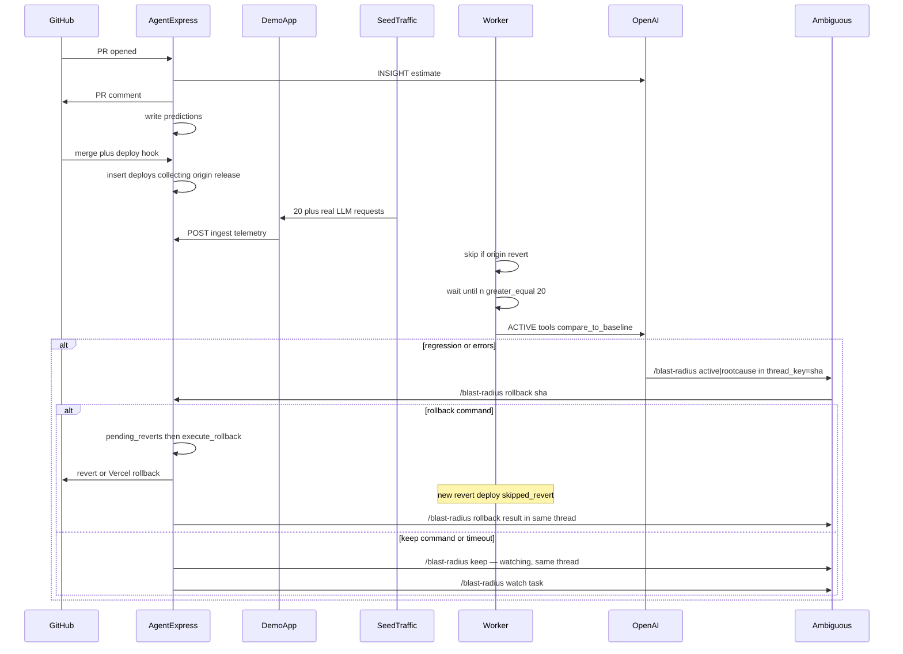

# Blast Radius — Technical Spec

AI agent that **owns** a bad LLM deploy: estimate impact on the PR, verify that estimate after deploy, alert in Ambiguous, wait for a human, then rollback / task / ledger / postmortem.

Heart of the product: **INSIGHT prediction is scored against ACTIVE telemetry.** Example: `predicted +240% cost, actual +238%`. Without INSIGHT there is no bridge.

INSIGHT cost is **deterministic** (price table in `agent/src/pricing.ts`: model swap, completion-call count, `max_tokens`). The LLM does not invent that percentage. Latency is an explicit estimate. Endpoint/error issues are qualitative flags with no numbers. ACTIVE verifies those estimates with live **LLM and HTTP/function** spans. ROOT CAUSE runs when production errors spike: which SHA they started after, `file:line` + author, a fix, and a **ranked suspect list** (never one culprit).

## Stack

- TypeScript, Node 22+ (local 26 is fine), Express, SQLite via built-in `node:sqlite`, OpenAI tool calling
- This repo: `/agent` (webhook + ingest + worker). Run locally; **Dockerfile** is the deploy artifact (no Fly.io).
- Demo: separate repo `blast-radius-demo` (Next.js 15 on Vercel). **All production-shaped telemetry comes from this app**, driven by `seed-traffic.js` (20+ real requests per deploy).
- Telemetry spans: `kind` = `llm` | `http` | `function`. Fields: `service.version`, `kind`, `name` (route or function), `latency_ms`, optional `error` / `error_message`, optional `request_id`. LLM spans also send `gen_ai.request.model` + token usage.
- `service.version` **is the git SHA**. That is the join key everywhere, including Ambiguous `thread_key`.
- One user request may emit several spans (http + llm + function) sharing `request_id`. `deploys.request_count` counts **requests**, not raw span rows.

## Data model (SQLite)

**processed_events** — webhook idempotency
- `delivery_id` TEXT PK
- `source` TEXT (`github` | `vercel` | `ingest`)
- `received_at` TEXT

**deploys**
- `sha` TEXT PK
- `previous_sha` TEXT
- `deployed_at` TEXT
- `origin` TEXT: `release` | `revert` (default `release`)
- `reverts_sha` TEXT NULL — SHA this deploy rolled back, when `origin=revert`
- `status` TEXT: `collecting` | `evaluated_ok` | `alerted` | `awaiting_approval` | `rolled_back` | `monitoring` | `insufficient_data` | `skipped_revert`
- `request_count` INTEGER DEFAULT 0
- `vercel_deployment_id` TEXT
- `github_compare_url` TEXT

**pending_reverts** — written by `execute_rollback` before the new SHA exists
- `id` INTEGER PK
- `rolled_back_sha` TEXT
- `created_at` TEXT
- `consumed_at` TEXT NULL

**telemetry**
- `id` INTEGER PK
- `sha` TEXT (`service.version`)
- `ts` TEXT
- `kind` TEXT (`llm` | `http` | `function`, default `llm`)
- `name` TEXT (route or function name)
- `model` TEXT
- `input_tokens` INTEGER
- `output_tokens` INTEGER
- `latency_ms` INTEGER
- `error` INTEGER (0/1)
- `error_message` TEXT
- `cost_usd` REAL (LLM spans; from static price table)
- `request_id` TEXT

**predictions** (INSIGHT) — required for the ACTIVE bridge
- `id` INTEGER PK
- `pr_number` INTEGER
- `head_sha` TEXT
- `merged_sha` TEXT (filled on merge)
- `estimated_cost_delta_pct` REAL
- `estimated_latency_delta_pct` REAL
- `rationale` TEXT
- `suspect_hints` TEXT (JSON: files, models, params, endpoints, functions, error_risk, authors)

**evaluations**
- `sha` TEXT PK
- `baseline_sha` TEXT
- `actual_cost_delta_pct` REAL
- `actual_latency_delta_pct` REAL
- `error_rate_delta` REAL
- `predicted_cost_delta_pct` REAL NULL
- `prediction_error_pp` REAL NULL
- `verdict` TEXT: `ok` | `cost_regression` | `latency_regression` | `error_spike`
- `summary` TEXT

**suspects**
- `id` INTEGER PK
- `sha` TEXT
- `rank` INTEGER
- `pr_number` INTEGER
- `author_login` TEXT
- `confidence` REAL
- `reason` TEXT

**actions** — Ambiguous side effects; one row per deploy max for the alert
- `sha` TEXT UNIQUE
- `poll_id` TEXT
- `sheet_appended` INTEGER
- `task_id` TEXT
- `doc_id` TEXT
- `rollback_executed` INTEGER DEFAULT 0

Constants: `MIN_REQUESTS=20`. No evaluation below that. Cost/latency regression default `+20%` vs previous **release** deploy with ≥20 requests. Error spike: error rate `≥5%` and `≥2x` baseline.

## Revert loop (do not evaluate our own rollback)

`git revert` + push (or Vercel rollback) creates a new deploy. If the worker treats it as a normal release, it may alert on the rollback itself.

Rules:
- `execute_rollback` inserts `pending_reverts(rolled_back_sha)` **before** the git/Vercel call.
- On deploy insert: if the commit subject starts with `Revert`, or a pending revert matches, set `origin=revert`, `reverts_sha`, `status=skipped_revert`, consume the pending row. Never enqueue evaluation.
- Vercel rollback to an **existing** SHA: PK collision, no new row, no re-eval.
- Baseline for a later real release skips revert deploys (previous **release** SHA only).
- Post in the original `thread_key` of `reverts_sha`: rollback deploy recorded, not evaluated.

## Agent tools

INSIGHT: deterministic cost from `pricing.ts` + one LLM call for latency estimate and qualitative risks + `comment_on_pr`. Channel message only if cost/latency crosses the regression threshold or an error risk is flagged. ACTIVE and ROOT CAUSE use the tool list below.

- `get_deploy_context(sha: string)` → deploy, baseline, linked PRs, predictions
- `summarize_telemetry(sha: string)` → n, cost_usd, p50/p95 latency, error_rate, by_model
- `compare_to_baseline(sha: string)` → deltas + predicted-vs-actual if any prediction maps to this deploy
- `github_compare(base: string, head: string)` → commits, files, PRs, authors
- `post_message(content: string, thread_key: string, starts_new_block?: boolean)` → Ambiguous chat (`thread_key` = deploy SHA). Follow-ups use `thread_id` of that thread.
- Channel commands (human, not LLM tools): `/blast-radius rollback {sha}`, `/blast-radius keep {sha}`, `/blast-radius status {sha}`. Agent posts use the same shape for actions; chat copy is human-readable.
- Sheet title: `Blast Radius — Deploy Ledger`. Docs: `Postmortem — {sha7} · {verdict} · {YYYY-MM-DD}`.
- `execute_rollback(sha: string)` — **hard-gated in code** on a matching `/blast-radius rollback {sha}` command in the channel; the model cannot bypass it; writes `pending_reverts`

Ambiguous client (not tools): base `https://app.ambiguous.ai`, headers `Authorization: Bearer <key>` + `API-Version: 1`. Endpoints as in the kickoff (sheet `id` top-level; range query param is `spec`).

## Event flow

1. `POST /webhooks/github` — `pull_request` opened/synchronize → **INSIGHT (required)**. Merged → set `predictions.merged_sha`. Push/deploy → insert `deploys` (`origin=revert` if revert, else `release`).
2. `POST /ingest` — auth via `INGEST_TOKEN`. Persist telemetry, bump `request_count`. Traffic source: demo app via `seed-traffic.js`.
3. Worker loop — ignore `origin=revert`. If `collecting` and `request_count >= 20`, evaluate. Else if superseded and still `< 20` → `insufficient_data` (no alert).
4. Evaluator writes `evaluations` including predicted-vs-actual. If verdict ≠ `ok`, run agent loop. Alert idempotency: `actions.sha` UNIQUE + Ambiguous `thread_key=sha`.
5. Ranked **suspect list** (never one culprit). Alert lists every ranked suspect with confidence; it does not name a single owner. Error spike alerts include `file:line` and the commit author.
6. Human types `/blast-radius rollback {sha}` or `/blast-radius keep {sha}` in the same thread. Rollback is never automatic. No command before `COMMAND_MINUTES` → keep + Task.
7. Failure handling lives in the core path (A1–A3), not in a later optional stage. README must list these scenarios (jury reads README, not the source tree).

HTTP: `GET /health`, `POST /ingest`, `POST /webhooks/github`, `POST /deploys` (Vercel), `GET /deploys/:sha`.

## Failure handling (required; implemented in A1–A3)

- **LLM timeout / 5xx** — abort after timeout, one retry, then post a stats-only alert (numbers, no narrative).
- **GitHub 5xx** — retry with backoff; do not mark the webhook as processed until success.
- **Idempotency** — `processed_events.delivery_id`; `actions.sha` UNIQUE; Ambiguous `thread_key = sha`. Re-runs do not double-post.
- **Insufficient data** — never evaluate a deploy with `< MIN_REQUESTS` (20). Superseded and still short → `insufficient_data`, no alert.
- **Revert loop** — `origin=revert` → `skipped_revert`, never evaluated.
- **No approval** — no `/blast-radius rollback` command before timeout; agent does not roll back; `/blast-radius keep` in the same thread + Task. Rollback is never automatic.
- **Bad ingest** — missing token or malformed OTel body rejected; accepted rows are append-only.

A6 is extra drills against this list, not the list itself. If A6 is skipped, this section still appears in README.

## Non-goals

- Slack, PagerDuty, Langfuse UI, multi-tenant SaaS
- Auto-rollback, buttons/action blocks
- Perfect token accounting (static USD table is enough)
- Ambiguous MCP (REST only)
- Fly.io or any extra host — Dockerfile + local run only
- Auth beyond ingest token + webhook secret
- Evaluating a deploy with fewer than 20 requests
- Evaluating revert/rollback deploys
- Sheets ledger + postmortem Doc as required surfaces (optional; Task on timeout is part of A4)
- A6 extra failure-handling drills (the handling itself is required in A1–A3 and must be listed in README)
